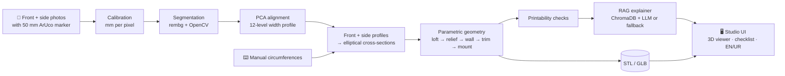

<div align="center">

# 🦾 LimbFit AI

### From two phone photos to a 3D-printable prosthetic socket draft, with a cited clinical checklist

*AI-assisted parametric socket design for rural technicians to support in Real World.*


[🎥 Demo video](https://www.youtube.com/watch?v=GlgCu_GVyWQ) · [🌐 Live demo](https://limbfit.vercel.app/) · [📟 Slides](https://docs.google.com/presentation/d/1MaVEONz1I13Rs5wxqYj5hppjrX4CQdDI/edit?rtpof=true&sd=true) · [📄 PRD](docs/PRD.md) 

<!-- TODO: replace the (#) links above with your real demo video and deployed URL -->


</div>

---

## Table of contents

1. [The problem](#-the-problem)
2. [Our solution](#-our-solution)
3. [Screenshots](#screenshots)
4. [How it works](#how-it-works-section)
5. [AI components](#-ai-components)
6. [Evaluation](#-evaluation)
7. [Getting started](#-getting-started)
8. [API reference](#-api-reference)
9. [Project structure](#-project-structure)
10. [Limitations and roadmap](#-limitations-and-roadmap)
11. [Safety statement](#safety-statement-section)
12. [Team](#-team)

---

## 🎯 The problem

In rural Punjab, agricultural machinery such as fodder cutters (*toka*) and threshers is a common cause of upper-limb injuries, mostly among young workers. Imported prostheses are unaffordable for most families.

3D printing has made the **material** cheap. The real bottleneck is **design expertise**: a custom socket (the part that fits the residual limb) normally needs trained CAD skills that local clinics and technicians do not have.


## 💡 Our solution

LimbFit AI lets a technician with **a smartphone and a 3D printer** produce a first socket draft:

1. 📸 Photograph the residual limb (front and side) next to a printed **50 mm ArUco marker**.
2. 📏 Computer vision calibrates scale and extracts the limb's cross-sections.
3. 🧱 A parametric geometry engine lofts those sections into a hollow, printable socket (STL and GLB).
4. 🎛️ The technician tunes wall thickness, relief and trim height in a live 3D studio.
5. 📚 A RAG pipeline retrieves guideline text and produces a **cited** rationale, a prosthetist checklist and a printing guide, in **English and Urdu**.

No CAD experience needed. A certified prosthetist always reviews the result before any fitting.

### Key features

| | Feature |
|---|---|
| 📷 | Marker-based calibration: no special camera, just a printed marker (downloadable PDF from the app) |
| ✂️ | Automatic limb segmentation and PCA-aligned profile extraction |
| ⌨️ | Manual-measurement fallback (type circumferences and length) when photos are not possible |
| 🧊 | Parametric socket generation: relief, wall thickness, trim line, distal mount plate, bolt hole |
| ✅ | Instant printability checks: watertightness, volume, PETG weight, material cost (PKR), max overhang |
| 🔎 | RAG rationale with source citations, plus a deterministic fallback when no LLM key is set |
| 🌐 | Bilingual UI (English / اردو) |
| ⚠️ | Safety banner and "draft for prosthetist review" framing throughout |

##  Screenshots

<table>
  <tr>
    <td align="center"><br><sub><b>Capture and input</b></sub></td>
    <td align="center"><br><sub><b>Socket studio with live 3D preview</b></sub></td>
  </tr>
  <tr>
    <td align="center" colspan="2"><br><sub><b>Quality checks and cited RAG rationale</b></sub></td>
  </tr>
</table>

<!-- TODO: check the captions match the screenshots, and add a photo of a real printed socket here (strongest evidence you can add). -->

<a id="how-it-works-section"></a>

## ⚙️ How it works



**Design principles** (also enforced in [`AGENTS.md`](AGENTS.md)):
- All geometry is in **millimetres**.
- Anything stubbed is named `stub_*` and listed under [Limitations](#-limitations-and-roadmap).
- Every reported metric must be reproducible from a script in `eval/` and written to a CSV.
- UI strings go through a bilingual (`en`, `ur`) dictionary.
- No authentication, payments or databases beyond ChromaDB.

### Tech stack

| Layer | Technology |
|---|---|
| Frontend | Next.js (React), React Three Fiber, Tailwind CSS |
| Backend | FastAPI, Pydantic |
| Vision | OpenCV (ArUco), rembg |
| Geometry | NumPy, Trimesh, Manifold3D |
| RAG | ChromaDB, sentence-transformer embeddings, OpenRouter (Mistral 7B) with deterministic fallback |
| Testing | pytest |

## 🧠 AI components

| Component | What it does | Where | Status |
|---|---|---|---|
| **Computer vision** | ArUco calibration, background removal, PCA-aligned width profiling | `backend/app/vision/core.py` | ✅ Integrated in the API |
| **RAG** | Retrieves guideline chunks from ChromaDB and generates a cited rationale, checklist and print guide | `backend/app/rag/` | ✅ Integrated in the API |
| **Embedding fine-tuning** | Domain-adapts the retrieval embedder (English + Roman Urdu queries) | `eval/retrieval/` | 🚧 <!-- TODO: update to ✅ once the real contrastive fine-tune is run and wired into retriever.py --> |
| **Vision model training** | Learned model for the vision stage | `eval/vision/` | 🚧 <!-- TODO: update once trained on realistic synthetic + real photos --> |

> **Transparency note:** the current training scripts in `eval/` are prototype-scale and are **not yet used by the production pipeline**. The live pipeline uses ArUco + rembg for vision and the default Chroma embedder for retrieval. See the [model card](docs/MODEL_CARD.md) and the numbers below for what is actually measured.

## 📊 Evaluation

Every number below is produced by a script in `eval/` and saved as a CSV.

### Retrieval (6 held-out test queries, small sample)

| Model | Recall@1 | Recall@3 | Recall@5 | MRR |
|---|---|---|---|---|
| Baseline (Chroma default embedder) | 0.333 | 0.500 | 1.000 | 0.517 |
| Fine-tuned (`limbfit-embedder`) | <!-- TODO --> | <!-- TODO --> | <!-- TODO --> | <!-- TODO --> |

Reproduce: `python -m eval.retrieval.baseline` → `eval/results/retrieval_baseline.csv`

### Geometry

| Case | Sections | Generation time | Meets < 5 s target |
|---|---|---|---|
| Short limb, 80 mm | 5 | 108 ms | ✅ |
| Medium limb, 130 mm | 6 | 29 ms | ✅ |
| Long limb, 180 mm | 6 | 28 ms | ✅ |
| Manual input | 4 | 28 ms | ✅ |

Reproduce: `python eval/reconstruction_accuracy.py` → `results/reconstruction_accuracy.csv`

> ℹ️ The reconstruction check compares generated geometry to its own input sections, so it shows internal consistency, not real-world accuracy.

### Real-photo measurement accuracy

<!-- TODO: run eval/real_image_accuracy.py on 10–20 consented photos with tape-measured circumferences and report mean / max error in mm here. -->

## 🚀 Getting started

### Prerequisites
- Python 3.10+ and Node.js 18+
- *(Optional)* an [OpenRouter](https://openrouter.ai) API key for LLM-written rationales. Without it, the app uses a deterministic fallback built from the retrieved chunks.

### 1. Clone
```bash
git clone https://github.com/SaifRasool92/limbfit.git
cd limbfit
```

### 2. Backend
```bash
cd backend
python3 -m venv venv
source venv/bin/activate          # Windows: venv\Scripts\activate
pip install -r requirements.txt

# optional: enable LLM rationales
export OPENROUTER_API_KEY=your_key_here

uvicorn app.main:app --reload --port 8000
```

### 3. Frontend
```bash
cd frontend
npm install
npm run dev
```
Open **http://localhost:3000**. The API runs at **http://localhost:8000** (docs at `/docs`).

### 4. Try it
1. Click **Download ArUco Marker PDF**, print it at 100% scale and check that the marker measures 50 mm.
2. Upload a front and a side photo with the marker beside the limb, or click **Load Sample Case**, or use **Manual Measurement Mode**.
3. Adjust the parameters, review the checks and rationale, then download the STL.

### Run the tests
```bash
cd backend
pytest
```

## 🔌 API reference

| Method | Endpoint | Purpose |
|---|---|---|
| `GET` | `/api/health` | Health check |
| `GET` | `/api/marker?size_mm=50` | Printable A4 PDF with an ArUco marker |
| `POST` | `/api/analyze` | Front + side photos → sections, socket (STL/GLB), checks, timings |
| `POST` | `/api/analyze_manual` | Circumferences + length → socket and checks |
| `POST` | `/api/regenerate` | Sections + parameters → updated socket |
| `POST` | `/api/explain` | RAG rationale, checklist and print guide |

## 📁 Project structure

```
limbfit/
├── backend/
│   ├── app/
│   │   ├── vision/        # ArUco calibration, segmentation, profile extraction
│   │   ├── geometry/      # parametric loft, socket build, STL/GLB export
│   │   ├── rag/           # ChromaDB ingest, retriever, explainer
│   │   ├── checks.py      # printability + cost checks
│   │   └── main.py        # FastAPI app
│   └── tests/             # pytest suites
├── frontend/              # Next.js studio (viewer, panels, bilingual i18n)
├── data/corpus/           # guideline corpus used for RAG
├── eval/                  # reproducible evaluation + training scripts
├── models/                # saved model weights
├── docs/                  # PRD and model card
└── AGENTS.md              # engineering rules for this repo
```

## 🚧 Limitations and roadmap

**Known limitations**
- **Ventilation ports** are stubbed (`stub_vent_geometry`) because the boolean subtraction is not yet reliable.
- **Cross-sections are modelled as ellipses** from two views; real limbs are not.
- **Measurement accuracy on real photos** is not yet validated.
- **The guideline corpus is synthetic**, written for this hackathon. It is not a substitute for clinical standards.
- Socket parameters (wall, relief, trim) are **placeholder defaults** that need prosthetist validation.

**Roadmap**
- [ ] Validate measurement error against tape measurements on real photos
- [ ] Integrate the fine-tuned embedder into the live retriever
- [ ] Train a segmentation model on realistic synthetic data and compare with rembg
- [ ] Implement ventilation ports
- [ ] Print and fit-test a socket with a certified prosthetist
- [ ] Offline-capable mobile web app
<a id="safety-statement-section"></a>

## ⚠️ Safety statement

> **LimbFit AI is a research and hackathon prototype. It is not a certified medical device.**
> Its output is a preliminary engineering draft. All geometry, parameters and checklists **must be reviewed by a certified prosthetist before any patient fitting.** Patient safety and clinical responsibility always take precedence over software-generated output.

## 👥 Team

<table>
  <tr>
    <td align="center" width="25%">
      <b>Saif Ur Rasool</b><br>
      <sub>Backend and Computer Vision</sub><br>
      <a href="https://www.linkedin.com/in/saif-ur-rasool">LinkedIn</a> · <a href="https://github.com/SaifRasool92">GitHub</a>
    </td>
    <td align="center" width="25%">
      <b>Zia Ur Rehman</b><br>
      <sub>Deployment and Fine-Tunning</sub><br>
      <a href="https://www.linkedin.com/in/zia-ur-rehman143/">LinkedIn</a> · <a href="https://github.com/Meharzain1020">GitHub</a>
    </td>
    <td align="center" width="25%">
      <b>Maryam Tariq</b><br>
      <sub>Presentations and Slides</sub><br>
      <a href="https://www.linkedin.com/in/mariam-tahir-">LinkedIn</a> · <a href="https://github.com/MariamTahir-07">GitHub</a>
    </td>
    <td align="center" width="25%">
      <b>Afeefa Batool</b><br>
      <sub>Planning and Research</sub><br>
      <a href="https://www.linkedin.com/in/afeefa-batool">LinkedIn</a> · <a href="https://github.com/Afeefa-Batool">GitHub</a>
    </td>
  </tr>
</table>

## 📜 License

<!-- TODO: add a LICENSE file (e.g. MIT) and name it here. The guideline corpus is synthetic; see data/corpus/LICENSES.md. -->

---

<div align="center"><sub>Made with care in Punjab, Pakistan 🇵🇰</sub></div>
